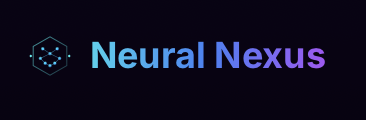

# Neural Nexus - AI Model Hub
_Star the Repo⭐_

<div align="center">
  
  <p style="font-size: 1.2em; color: #00BFFF; font-weight: bold;">The Ultimate Hub for AI Innovators</p>
  
  [](https://github.com/Drago-03/Neural-Nexus/stargazers)
  [](https://github.com/Drago-03/Neural-Nexus/network/members)
  [](https://github.com/Drago-03/Neural-Nexus/issues)
  [](https://github.com/Drago-03/Neural-Nexus/blob/main/LICENSE)
  [](https://discord.gg/neuralnexus)
  
  <a href="https://www.buymeacoffee.com/neuralnexus"></a>
  <a href="https://www.producthunt.com/posts/neural-nexus"></a>
  <a href="https://tech.dev/neural-nexus"></a>
</div>

## Welcome to Neural Nexus

Welcome to **Neural Nexus**, a comprehensive AI model hub where you can upload, sell, and transfer ownership of your AI creations using various payment methods including cryptocurrency, UPI, PayPal, and net banking. We focus on building a vibrant community of creators and innovators shaping the future of AI, emphasizing innovation and collaboration.

We're inspired by the 'Radio on the Internet' concept for AI—powered by strategic partnerships and a commitment to open access. Our mission is to democratize AI by providing free models and data, inspired by the Transformers library from Hugging Face, while also offering premium content for advanced users.

## Features

- **Upload AI Models**: Share your models with the world
- **Secure Payments**: Process payments via Stripe, Razorpay (UPI), or Cryptocurrency (MetaMask)
- **Modern Authentication**: Sign in with Google, GitHub, email, or cryptocurrency wallets
- **Ownership Transfer**: Transfer model ownership with blockchain security
- **Open Source Models**: Access a comprehensive library of free models inspired by Transformers
- **Premium Marketplace**: Buy and sell premium models and datasets for advanced projects
- **Modern UI**: Responsive design with smooth animations and contemporary aesthetics

## Technology Stack

- **Next.js**: React framework for high-performance applications
- **Tailwind CSS**: Utility-first CSS framework for modern styling
- **Framer Motion**: Animation library for enhanced user experience
- **Supabase**: Open-source Firebase alternative for authentication and database management
- **Stripe & Razorpay**: Payment processing solutions
- **Edge Functions**: Lightweight serverless functions for optimal performance

## Setup Guide

1. **Clone the Repository**:
   ```bash
   git clone https://github.com/Drago-03/Neural-Nexus.git
   cd Neural-Nexus
   ```

2. **Install Dependencies**:
   ```bash
   npm install
   ```

3. **Set Environment Variables**:
   Create a `.env.local` file in the root directory using the `.env.local.example` as a template:
   ```bash
   cp .env.local.example .env.local
   ```
   Then edit the file to add your actual credentials.

4. **Supabase Setup (Main Database & Auth)**:
   
   a. Create a Supabase project at [Supabase](https://supabase.com/) (free tier available)
   
   b. Get your API credentials:
      - Go to Project Settings > API
      - Copy the URL, public anon key, and service role key
      - Add them to your `.env.local` file
   
   c. Initialize the database:
      - After setting up your project and environment variables, run:
      ```bash
      # Start your Next.js dev server
      npm run dev
      
      # In a new terminal, initialize the database (one-time setup)
      curl "http://localhost:3000/api/supabase-setup?setup_key=YOUR_SETUP_KEY_FROM_ENV"
      ```
      
   d. Enable authentication providers:
      - Go to Authentication > Providers
      - Enable Email, Google, GitHub, etc. as needed
      - Configure OAuth credentials for third-party providers
      - **For GitHub OAuth**: 
        - Go to your GitHub account > Settings > Developer settings > OAuth Apps > New OAuth App
        - Set the callback URL to exactly: `https://[YOUR-PROJECT-REF].supabase.co/auth/v1/callback`
        - Copy the Client ID and Client Secret to Supabase GitHub provider settings
        - It's critical that the callback URL matches exactly what Supabase expects
      - **For Google OAuth**:
        - Set the callback URL to exactly: `https://[YOUR-PROJECT-REF].supabase.co/auth/v1/callback`
        - Make sure to add the same domain to your authorized redirect URIs
      
   e. Enable anonymous authentication:
      - Go to Authentication > Providers
      - Scroll down to "Anonymous Sign-in" and toggle it on
      - This allows users to try the platform without creating an account
   
   f. Set up storage buckets:
      - Go to Storage
      - Create buckets for: `models`, `avatars`, `thumbnails`
      - Set RLS policies for each bucket

5. **Firebase Setup (Legacy/Optional)**:
   
   The app is transitioning from Firebase to Supabase, but can still use Firebase for some features.
   
   a. Create a Firebase project at [Firebase Console](https://console.firebase.google.com/)
   
   b. Enable Authentication services:
      - Go to Authentication > Sign-in method
      - Enable Email/Password and Google sign-in methods
   
   c. Create a Firestore database:
      - Go to Firestore Database > Create database
      - Start in production mode
      - Choose a location close to your users
   
   d. Set up Storage:
      - Go to Storage > Get started
      - Set up security rules for production
   
   e. Get your Firebase config:
      - Go to Project settings > General
      - Scroll down to "Your apps" and select your web app
      - Copy the Firebase config values to your `.env.local` file

6. **Run Locally**:
   ```bash
   npm run dev
   ```
   Open `http://localhost:3000` to view the application.

## Community & Support

Join our active community to get help, share ideas, and connect with other developers!

<div align="center">
  <a href="https://discord.gg/neuralnexus"></a>
  <a href="https://twitter.com/NeuralNexusAI"></a>
  <a href="https://github.com/Drago-03/Neural-Nexus/discussions"></a>
</div>

## Supabase Data Model

The application uses the following Supabase tables:

### **user_profiles**
```sql
CREATE TABLE user_profiles (
  id UUID PRIMARY KEY DEFAULT uuid_generate_v4(),
  user_id UUID REFERENCES auth.users(id) ON DELETE CASCADE,
  first_name TEXT,
  last_name TEXT,
  display_name TEXT,
  email TEXT,
  bio TEXT,
  avatar_url TEXT,
  website TEXT,
  social_links JSONB,
  created_at TIMESTAMP WITH TIME ZONE DEFAULT CURRENT_TIMESTAMP,
  updated_at TIMESTAMP WITH TIME ZONE DEFAULT CURRENT_TIMESTAMP
);
```

### **models**
```sql
CREATE TABLE models (
  id UUID PRIMARY KEY DEFAULT uuid_generate_v4(),
  user_id UUID REFERENCES auth.users(id) ON DELETE CASCADE,
  name TEXT NOT NULL,
  description TEXT,
  price DECIMAL(10, 2) DEFAULT 0,
  category TEXT,
  tags TEXT[],
  file_url TEXT,
  file_path TEXT,
  file_size BIGINT,
  file_type TEXT,
  thumbnail_url TEXT,
  created_at TIMESTAMP WITH TIME ZONE DEFAULT CURRENT_TIMESTAMP,
  updated_at TIMESTAMP WITH TIME ZONE DEFAULT CURRENT_TIMESTAMP,
  downloads INTEGER DEFAULT 0,
  rating DECIMAL(3, 2) DEFAULT 0,
  is_public BOOLEAN DEFAULT true,
  status TEXT DEFAULT 'active'
);
```

## Deployment on Vercel

1. Push your code to a GitHub repository
2. Go to [Vercel](https://vercel.com) and create a new project
3. Connect your GitHub repository
4. Set all the environment variables from your `.env.local` file in the Vercel dashboard
5. Deploy your application

### **Setting Up Environment Variables on Vercel**
- Go to your project settings in Vercel
- Navigate to Environment Variables
- Add all the variables from your `.env.local` file
- Make sure to set `NEXT_PUBLIC_APP_ENV=production`
- Redeploy your application to apply the changes

## Monitoring and Analytics

Both Supabase and Firebase provide tools to monitor your application:

1. **Supabase Dashboard**: Track database usage, API calls, and authentication
2. **Firebase Analytics** (if using): Track user engagement and app usage
3. **Vercel Analytics**: Monitor page performance and user metrics

## Edge Functions vs. Serverless Functions

This app uses both Edge Functions (for lightweight operations) and standard serverless functions (for heavier processing):

- **Edge Functions**: Fast, lightweight API routes that run globally close to users
- **Serverless Functions**: More powerful Node.js environments for database operations and complex processing

## Web3 Wallet Integration

Neural Nexus includes a lightweight wallet connection system through the `SimpleCryptoProvider`. This replaces the previous TonConnect implementation.

### **Enabling the Wallet Connection**

To enable wallet connection in your application:

1. Set the feature flag in your `.env.local` file:
```
NEXT_PUBLIC_ENABLE_SIMPLE_CRYPTO=true
```

2. The wallet connect button will automatically appear in the navbar when the feature flag is enabled.

3. For custom integration, you can use the `SimpleCryptoButton` component:
```tsx
import dynamic from 'next/dynamic';

// Import with dynamic to avoid SSR issues
const SimpleCryptoButton = dynamic(
  () => import('@/components/SimpleCryptoButton'),
  { ssr: false }
);

// Then use it in your component
function MyComponent() {
  return <SimpleCryptoButton />;
}
```

4. For direct access to wallet state, use the `useSimpleCrypto` hook:
```tsx
import { useSimpleCrypto } from '@/providers/SimpleCryptoProvider';

function MyComponent() {
  const { activeWallet, connectWallet, disconnectWallet } = useSimpleCrypto();
  
  return (
    <div>
      {activeWallet ? (
        <div>Connected to: {activeWallet}</div>
      ) : (
        <button onClick={() => connectWallet('MetaMask')}>Connect</button>
      )}
    </div>
  );
}
```

## Policies & Documentation

We maintain comprehensive documentation on how we handle data, models, and content. Please review our policies for complete transparency:

- **Privacy Policy**: Learn how we protect your data and maintain information security. [Read More](docs/PRIVACY_POLICY.md)
- **Content Policy**: Keep the vibes positive! Understand what content is cool to share on Neural Nexus. [Read More](docs/CONTENT_POLICY.md)
- **Model Policies**: Rules for uploading and sharing AI models. Let's keep the AI game fair and innovative. [Read More](docs/MODEL_POLICIES.md)
- **Cookie Policy**: We use cookies to make your experience smoother than butter. Find out how. [Read More](docs/COOKIE_POLICY.md)
- **Updates & Changelog**: Stay updated with the latest changes and features. We're always leveling up! [Read More](docs/UPDATES.md)

These docs are here to ensure we're all on the same page, building a safe and creative space for AI innovation. Got questions? Hit us up! 💬

## Build Instructions

When building the project for production, you might encounter "document is not defined" errors for authentication pages. This is a common issue with Next.js when client-side features are used during static site generation.

To solve this issue, use our custom build and start scripts:

```bash
# Step 1: Use our custom build script that patches the auth pages
npm run custom-build

# Step 2: Start the application using our custom server
npm run custom-start
```

Our custom build script (`build-with-cleanup.sh`) handles the following:
1. Cleans up previous build artifacts
2. Runs the Next.js build process
3. If auth page errors occur, it patches the build by:
   - Creating fallback static HTML files for problematic routes
   - Copying these files to the appropriate output directories

The custom server (`dev-server.js`) then:
1. Serves the static HTML fallbacks for auth routes
2. Handles all other requests normally through Next.js

This approach ensures that authentication pages work correctly in production without the "document is not defined" errors.

## Build Instructions for Auth Pages

Next.js has challenges with client-side authentication pages during static site generation, often resulting in "document is not defined" errors. This project includes special handling to resolve these issues:

### Using the Custom Build Process

```bash
# Run the custom build script that handles auth page issues
npm run custom-build
```

This script:
1. Cleans previous build artifacts
2. Creates static HTML fallbacks for auth pages if needed
3. Runs the build with proper environment variables
4. Patches the generated files to ensure auth pages work correctly

### Using the Custom Server

After building the project, start it with:

```bash
# Start the custom server that handles auth pages
npm run custom-start
```

This custom server serves static HTML fallbacks for authentication pages, preventing issues with client-side code during the initial page load.

### How It Works

The solution uses multiple techniques:
- Middleware detection for build vs. runtime environments
- Static HTML fallbacks for auth pages
- Custom server for serving static content
- Next.js configuration to properly handle client-only pages

If you modify auth-related pages, ensure the build process is aware of these pages by updating the configuration in:
- `middleware.ts`
- `next.config.js`
- `build-with-cleanup.sh`

## Overview
Neural Nexus is a powerful platform for AI model deployment, collaboration, and marketplace. It integrates modern web technologies with AI capabilities to provide a seamless experience for researchers, developers, and users.

## Key Features
- 🧠 AI model marketplace and deployment
- 🔒 Secure authentication with multiple providers
- 💰 Payment processing with Stripe and Web3
- 📊 Advanced analytics dashboard
- 🚀 Fast, modern UI built with Next.js and Tailwind CSS

## Tech Stack
- **Frontend**: Next.js, React, Tailwind CSS
- **Authentication**: Supabase Auth, NextAuth.js
- **Database**: Supabase PostgreSQL
- **Payment**: Stripe, Coinbase SDK
- **Deployment**: Vercel/Netlify compatible

## Getting Started

### Prerequisites
- Node.js 18+ 
- npm or yarn

### Installation
```bash
# Clone the repository
git clone https://github.com/Drago-03/neural-nexus.git
cd neural-nexus

# Install dependencies
npm install

# Set up environment variables
cp .env.example .env.local
# Edit .env.local with your credentials

# Start development server
npm run dev
```

### Build Instructions

When building the project for production, you might encounter "document is not defined" errors for authentication pages. This is a common issue with Next.js when client-side features are used during static site generation.

For the best production build experience, use our custom build scripts:

```bash
# Standard build with patching
npm run build

# OR for a more thorough approach with cleanup
npm run custom-build
```

The build process includes:
1. Pre-build preparation of static HTML fallbacks
2. The main Next.js build
3. Post-build patching to ensure all files are present

### Running in Production

```bash
# Standard Next.js server
npm run start

# Custom server with enhanced handling of auth pages
npm run custom-start
```

## Troubleshooting Common Issues

### "document is not defined" Errors
These errors occur during server-side rendering of pages that use client-side browser objects. Our build process automatically handles this by:
1. Using static HTML fallbacks for auth pages
2. Patching build artifacts post-build
3. Setting proper runtime configurations

### Edge Runtime Configuration
We use the experimental edge runtime for authentication pages. If you encounter issues:
```bash
# Check that your next.config.js has the correct settings
# Ensure each auth page exports the runtime configuration
export const runtime = "experimental-edge";
```

### Missing Build Artifacts
If your deployment is missing critical files:
```bash
# Run the patch script manually
node ./scripts/patch-build.js
```

## Contributing
Contributions are welcome! Please check out our [Contributing Guide](CONTRIBUTING.md) for details.

<a href="https://github.com/Drago-03/Neural-Nexus/blob/main/CONTRIBUTING.md">
  
</a>

### Open Bounties

<a href="https://github.com/Drago-03/Neural-Nexus/labels/bounty">
  
</a>

Get paid to contribute! Check out our open bounties and earn rewards for your contributions.

## License
This project is licensed under the MIT License - see the [LICENSE](LICENSE) file for details.

## GitHub Workflows and Automation

This repository uses several GitHub Actions workflows to automate processes and improve collaboration:

### Automatic PR Labeling

Pull requests are automatically labeled based on the files changed:

- **frontend**: Changes to app, src, components, or public directories
- **backend**: Changes to lib, api, server, or providers directories
- **documentation**: Changes to markdown files or docs directory
- **config**: Changes to configuration files
- **dependencies**: Changes to package.json or lock files
- **testing**: Changes to test files
- **ui**: Changes to CSS, styles, or UI components
- **auth**: Changes to authentication-related code
- **feature**: Changes to feature-specific directories

PRs are also labeled by size:
- **XS**: < 10 lines
- **S**: 10-99 lines
- **M**: 100-299 lines
- **L**: 300-499 lines
- **XL**: 500-999 lines
- **XXL**: 1000+ lines

### Issue Labeling

Issues are automatically labeled based on their title and content:

- **bug**: Issues reporting bugs or problems
- **enhancement**: Feature requests and improvements
- **documentation**: Documentation-related issues
- **question**: Questions and help requests
- **performance**: Performance-related issues
- **security**: Security-related issues
- **ui**: UI/UX-related issues
- **auth**: Authentication-related issues
- **good first issue**: Issues suitable for newcomers

### Dependency Management

Dependabot automatically creates PRs for dependency updates:

- NPM dependencies are checked weekly
- GitHub Actions are checked weekly
- All updates require manual review and approval

### Stale Issue Management

Issues and PRs with no activity for 30 days are marked as stale and closed after 7 more days of inactivity. Issues labeled as bug, security, enhancement, documentation, or good first issue are exempt.

### Code Ownership

The CODEOWNERS file automatically assigns reviewers to PRs based on the files changed.

## Sponsors

We're grateful to our sponsors who make this project possible.

<div align="center">
  <a href="https://tech.dev"></a>
  <a href="https://yourcompany.com"></a>
  <a href="https://anothercompany.com"></a>
</div>

<div align="center">
  <a href="https://github.com/sponsors/Drago-03"></a>
</div>

## Contributing

Got ideas to make this even more lit? Drop a PR or issue. Let's build this together! 💡

### **Contributors**
Thanks to all our awesome contributors who are helping build Neural Nexus! 🔥

<a href="https://github.com/Drago-03/Neural-Nexus/graphs/contributors">
  
</a>

---

<div align="center">
  
  
  <blockquote>
    <p><em>"The future belongs to those who believe in the beauty of their code."</em></p>
    <p>— Neural-Nexus Team</p>
  </blockquote>
</div>

<p align="center">
  <a href="#top">
    
  </a>
</p>

## License

© 2025 Indie Hub. All rights reserved. Keep it real, fam! ✌️
