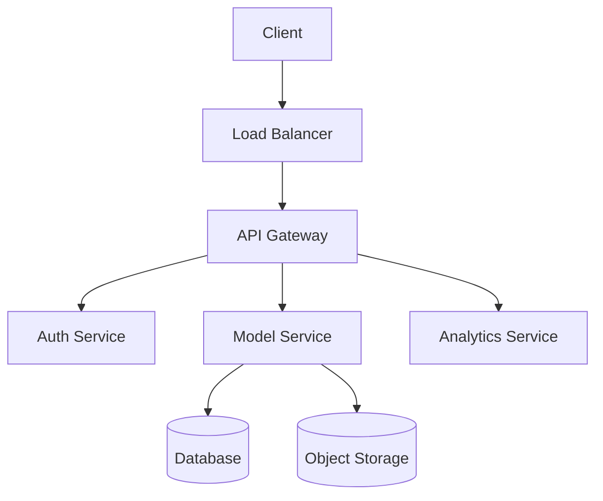

# AI Model Marketplace Wiki

Welcome to the AI Model Marketplace Wiki! This document serves as the central knowledge base for understanding and working with our platform.

## Table of Contents
- [Platform Overview](#platform-overview)
- [Architecture](#architecture)
- [Development Guides](#development-guides)
- [Best Practices](#best-practices)

## Platform Overview

### Core Features
- AI model discovery and distribution
- Model versioning and management
- Performance analytics
- Monetization system
- User authentication and authorization

### System Components
1. **Frontend Application**
   - React-based SPA
   - Tailwind CSS styling
   - Component library
   - Analytics dashboard

2. **Backend Services**
   - RESTful API
   - Authentication service
   - Analytics engine
   - Payment processing
   - Storage management

3. **Database Structure**
   - User management
   - Model metadata
   - Transaction records
   - Analytics data
   - Review systems

## Architecture

### Technical Stack
- Frontend: React, TypeScript, Tailwind CSS
- Backend: Node.js, Express
- Database: PostgreSQL
- Caching: Redis
- Search: Elasticsearch
- Storage: AWS S3

### System Design

## Development Guides

### Local Development Setup
1. Clone repositories
2. Install dependencies
3. Configure environment
4. Start development servers

### Testing Strategy
- Unit tests
- Integration tests
- End-to-end tests
- Performance testing
- Security testing

## Best Practices

### Code Style
- Follow TypeScript best practices
- Use ESLint and Prettier
- Follow component design patterns
- Implement proper error handling

### Security Guidelines
- Input validation
- Authentication checks
- Rate limiting
- Data encryption
- Regular security audits